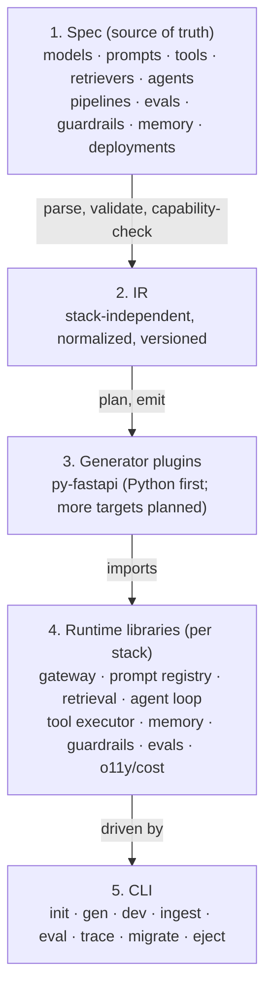

# AID Framework

**AID** (AI Development Framework) lets you *declare* an AI application once — models, prompts, tools,
retrieval, agents, pipelines, evals, guardrails, memory, and deployments — and compile it into idiomatic,
runnable AI services across multiple language stacks.

> **Status: pre-alpha.** This repository is being bootstrapped. [`docs/design.md`](docs/design.md) is the
> authoritative design document; Phase 0 implementation has not started.

## The problem

Every AI app re-implements the same 70–85% of non-differentiating plumbing: provider adapters and streaming,
retries and rate limits, token/cost budgeting, prompt templating and versioning, structured-output
enforcement, RAG ingestion and retrieval, agent loops and tool execution, memory, guardrails, tracing,
caching, and evals. None of it is the product, and most of it is easy to get subtly wrong.

AID Framework makes that tier *generated, correct, traced, and regenerable*, so you spend your time on the
parts that are actually yours: **domain prompts, domain tools, and evaluation criteria**.

## How it works

A single declarative spec is validated and normalized into a stack-independent IR; generator plugins turn
that IR into small, declarative glue; hand-written per-stack runtime libraries provide the behavior; the CLI
drives the whole loop.



Two correctness regimes ship together from day one: **golden-file tests** verify generated *code*, and an
**eval harness** verifies model *behavior*. See [`docs/design.md`](docs/design.md) for the full architecture,
the IR, the CLI surface, and the roadmap.

## Repository layout

| Path | Responsibility |
| --- | --- |
| [`docs/`](docs/) | Design documentation. [`docs/design.md`](docs/design.md) is authoritative. |
| [`packages/spec/`](packages/spec/) | The declarative spec DSL plus JSON Schema, parser, and validator. |
| [`packages/ir/`](packages/ir/) | The stack-independent IR: types, builder, normalization, validation. |
| [`packages/generator-sdk/`](packages/generator-sdk/) | The generator plugin interface and determinism contract. |
| [`packages/generators/`](packages/generators/) | Generator plugins, one per target stack. |
| [`packages/cli/`](packages/cli/) | The command-line interface. |
| [`runtimes/`](runtimes/) | Hand-written per-stack runtime libraries — the real framework. |
| [`examples/`](examples/) | Example specs and generated apps. |

## Quickstart

> Placeholder — the CLI is not implemented yet. The intended flow:

```bash
aid init my-app --spec app.spec.yaml   # scaffold from a spec
aid gen --dry-run                      # inspect the file set without writing
aid gen && aid dev                     # generate, then run locally
aid eval --baseline                    # run evals and gate on regressions
```

## Contributing

Contributions are welcome — prompts, tools, rubrics, generators, runtimes, docs, and bugs. We use the
**Developer Certificate of Origin (DCO)**, not a CLA: sign off your commits with `git commit -s`.

See [`CONTRIBUTING.md`](CONTRIBUTING.md) for development setup and pull request expectations, and
[`CODE_OF_CONDUCT.md`](CODE_OF_CONDUCT.md) for community standards. Security issues: see
[`SECURITY.md`](SECURITY.md).

## Licensing

AID Framework is licensed under the [Apache License 2.0](LICENSE). See [`NOTICE`](NOTICE) for attribution.

> **Generated-output carve-out:** The AID Framework is licensed under Apache-2.0. Code generated by AID
> Framework is not subject to the AID Framework's license — you own it and may license it however you wish.
